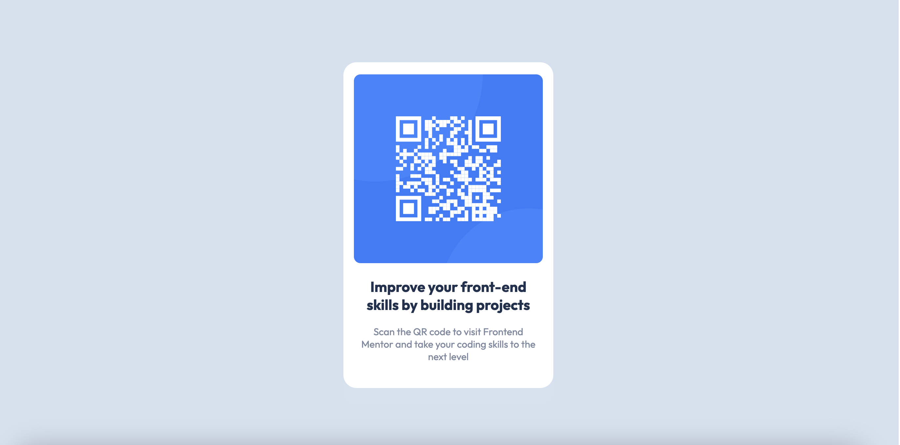

# Frontend Mentor - QR code component

## Table of contents

- [Overview](#overview)
  - [Screenshot](#screenshot)
  - [Links](#links)
- [My process](#my-process)
  - [Built with](#built-with)
  - [What I learned](#what-i-learned)
  - [Continued development](#continued-development)

## Overview

### Screenshot



### Links

- Solution URL: (https://github.com/katbetancourt/qr-code-component-main.git)
- Live Site URL: (https://katbetancourt.github.io/qr-code-component-main/)

## My process

### Built with

- Semantic HTML5 markup
- CSS custom properties
- Flexbox

### What I learned

```html
<h1>Some HTML code I'm proud of</h1>
```

```css
.proud-of-this-css {
  color: papayawhip;
}
```

### Continued development

I would like to continue improving my knowledge on CSS and preprocessor like
Sass Also, I want to learn about responsive design and how to make my components
work well on different screen sizes. Javascript to make my projects more
interactive, and frameworks like react.

## Author

- Website - [Katherine Caguenas](https://www.your-site.com)
- Frontend Mentor -
  [@yourusername](https://www.frontendmentor.io/profile/katbetancourt)
